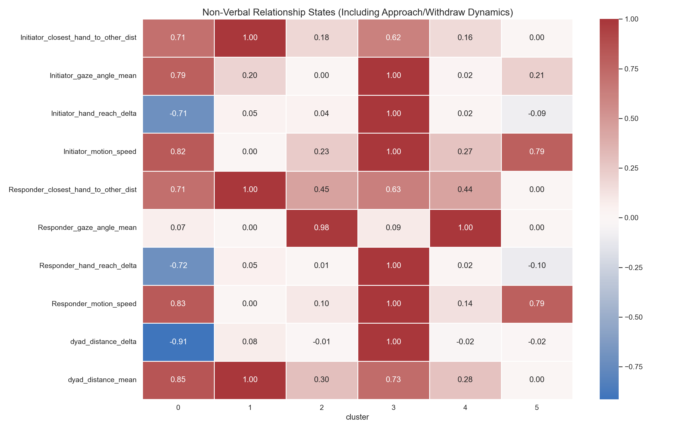

# Non-Verbal Relationship Analysis

We successfully extracted and analyzed **131,907 valid frames** across all 44 sessions simultaneously. We computed features across sliding windows (2-second intervals) focusing specifically on how the two individuals react to each other (e.g., reaching vs. pulling back).

We discovered 6 distinct **Relationship States (Clusters)**. Each cluster represents a common pattern of interaction between the **Initiator** (who we define dynamically as the more active person in that window) and the **Responder** (the partner in that window). By defining these roles dynamically rather than rigidly as "Person A" and "Person B," we capture a true dictionary of non-verbal interactions regardless of who performed the action.

## Visualizing the Discovered Behaviors

Below is the heatmap profile showing what characterizes each discovered interaction state. *Note: For the "delta" values (like reach_delta), negative values mean they are getting closer/reaching, while positive values mean they are pulling away.*

## Interpretations of the Relationship States

Here is how we can interpret these clusters in the context of their responses to each other:

### Cluster 0: "Active Approach & Mutual Reaching" (507 windows)
- **What's happening:** The Initiator is moving quickly and reaching toward the Responder. In response, the Responder is also slightly reaching.
- **Key indicator:** High negative `Initiator_hand_reach_delta` and a negative `dyad_distance_delta`.
- **Relationship dynamic:** High engagement. One person initiates an approach or points, and the partner leans in or reaches back.

### Cluster 1: "Initiator Reaching while Responder Pulls Back" (843 windows)
- **What's happening:** The Initiator reaches toward the Responder's head/body, but the Responder is pulling their own hand away or shifting back.
- **Key indicator:** Negative reach delta for the Initiator, but positive reach delta for the Responder.
- **Relationship dynamic:** Asymmetry. The Initiator is invading space or reaching out, and the Responder is defensively reacting or yielding space.

### Cluster 2: "Synchronized Withdrawing" (407 windows)
- **What's happening:** Both individuals are moving apart.
- **Key indicator:** High positive `dyad_distance_delta` and positive reach deltas for both people.
- **Relationship dynamic:** Disengagement. They just finished an intense interaction and are both leaning back to baseline.

### Cluster 3: "Initiator Dominant with High Gaze" (425 windows)
- **What's happening:** The Initiator is moving relatively fast and maintaining a very direct gaze angle toward the Responder, while the Responder is mostly still.
- **Relationship dynamic:** Active speaking or demonstrating. The Initiator is the focal point, commanding attention, and the Responder is the passive listener.

### Cluster 4: "Close Proximity Stillness" (458 windows)
- **What's happening:** They are very close together (`dyad_distance_mean` is low, hand distances are low) but motion speed is near zero.
- **Relationship dynamic:** Intimate/Focus State. They are likely looking at the same object or maintaining steady mutual gaze in close proximity without erratic movements.

### Cluster 5: "Initiator Retreats" (591 windows)
- **What's happening:** The Initiator was close but is now rapidly pulling their hand back (high positive `Initiator_hand_reach_delta`).
- **Relationship dynamic:** Reactionary yielding. The Initiator realizes they reached too far or finished an action and quickly retracts.

## Next Steps

1. **Session-Specific Timelines:** The sequence of these states for every individual session has been saved to `session_clusters.csv`. For example, we can see a session start in "Close Proximity Stillness" (Cluster 4) and rapidly transition into "Active Approach" (Cluster 0). We can plot a timeline for specific sessions you find interesting.
2. **Review Specific Pairs:** If some sessions belong to a specific pair of people (e.g., Order 1 vs Order 2), we can now filter this CSV to see if "Pair X" spends 80% of their time in "Mutual Reaching", whereas "Pair Y" spends most of their time in "Initiator Reaching while Responder Pulls Back".